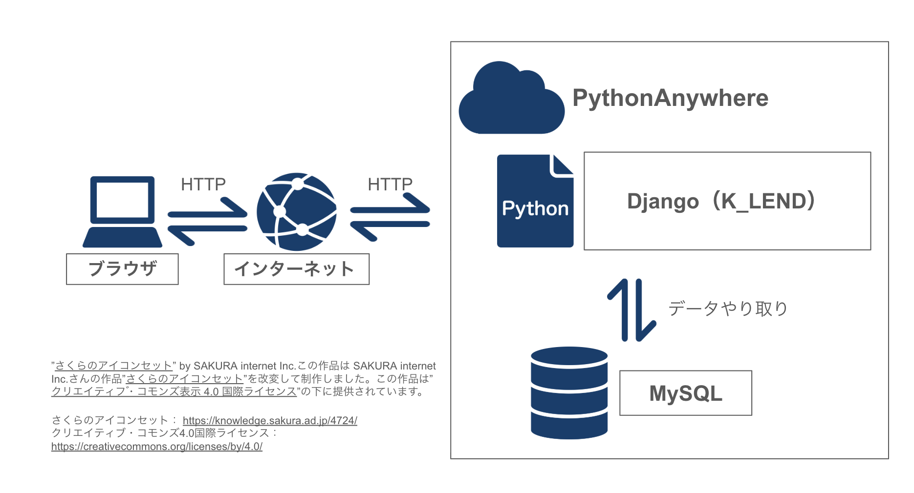

# K-LEND

## システム要件

### a.概要

- KAISHILABでの利用を想定した機材の貸出管理システムである。

### b.目的

- 現在の紙による管理から、Djangoを利用したWEBシステム化することで、ネットを通してどこからでも管理できるようにする。

### c.背景

- 現在、現在の紙による管理をしているため、記載に時間がかかる、機材などの名称がわからない、字が汚いと読めないなどの問題がある。

### d.想定利用者

- 機材貸出担当・機材管理者

### e.想定利用ストーリー

#### 職員（システム管理者）

1. システム管理用のアカウントでログインする。
2. 全カウントの管理、機材情報、貸出記録の管理を行う。
3. 貸出記録を一括でPDFに出力する。

#### 職員（機材貸出担当・機材管理者）

1. 貸出記録管理用のアカウントでログインする。
2. 必要な場合は、貸し借り状況を見ながら機材の在庫チェックなど行う。結果を報告できるようPDFで出力する。
3. 受付で機材利用者の情報を聞き貸出データを作成する。

#### 貸出機材利用者

1. 機材貸出開始時、受付で職員に声をかけ機材を借りる。受付で職員から個人情報を聞かれるので答える。
2. 機材返却時、受付で職員に声をかけ機材を返却する。

## 機能要件

### a.システム構成図



### b.クラウドサービス

| **名称** | **概要**                                                           |
| -------------- | ------------------------------------------------------------------------ |
| PythonAnywhere | クラウドでPythonをホスト、実行、コーディングできるPaaSのクラウドサービス |

### c.独 ⾃ 開 発 部 分 以 外 の使 ⽤ 外 部 サービス

| **名称** | **概要**                                                                                          |
| -------------- | ------------------------------------------------------------------------------------------------------- |
| Django         | PythonのWebアプリケーションフレームワーク                                                               |
| django-environ | Djangoで「環境変数」を使いやすく管理するためのライブラリ                                                |
| django-axes    | Djangoに「ログイン試行の制限」機能を追加するライブラリ                                                  |
| DRF            | Django REST Framework の略で、Django Webフレームワークで RESTful API を開発しやすくするためのライブラリ |
| Bootstrap      | CSSフレームワーク                                                                                       |
| Reportlab      | PythonでPDFファイルをプログラム的に生成できるライブラリ                                                 |
| PyOTP          | ワンタイムパスワードの生成と検証を行うPythonライブラリ                                                  |
| qrcode         | QR コードを生成を行うPythonライブラリ                                                                   |

### d.想定画面

#### ブラウザ

- [マニュアル（k_lend/static/pdf/manual.pdf）](./static/pdf/manual.pdf) から詳細を確認できます。

| **名称**           | **概要**                                                                                                                     |
| ------------------------ | ---------------------------------------------------------------------------------------------------------------------------------- |
| ログイン画面             | ユーザーがシステムにログインするための画面。二要素認証（2FA）にも対応。                                                            |
| ログアウト画面           | ユーザーがシステムからログアウトするための画面。                                                                                   |
| ライセンス表示画面       | 利用中のサードパーティライブラリのライセンス情報を一覧表示する画面。                                                               |
| マニュアル表示画面       | システムの利用方法を記載したマニュアル（PDF）を閲覧するための画面。                                                                |
| アカウント一覧画面       | ユーザーのアカウント情報を一覧表示する画面。管理者ユーザーは全アカウントを確認可能で、職員ユーザーは自身のアカウントのみ閲覧可能。 |
| アカウント作成画面       | 管理者ユーザーが新規アカウントを作成するための画面。                                                                               |
| アカウント更新画面       | 管理者ユーザーが既存のアカウント情報を編集・更新するための画面。                                                                   |
| アカウント2FA設定画面    | 各アカウントに対して二要素認証（2FA）の設定を行うための画面。                                                                      |
| 機材一覧画面             | 貸出対象の機材情報を一覧表示する画面。機材の有効化・無効化の設定も可能。                                                           |
| 機材作成画面             | 新たに貸出機材を登録するための画面。                                                                                               |
| 機材更新画面             | 登録済みの貸出機材情報を編集・更新するための画面。                                                                                 |
| 機材QRコード表示画面     | 機材管理用のQRコードを表示する画面。機材ごとに個別のQRコードを生成・表示。                                                         |
| 機材確認画面             | 機材の点検や状態確認を行うための画面。点検結果はPDFとして保存可能。                                                                |
| 貸出記録一覧画面         | 機材の貸出履歴を一覧表示する画面。検索機能や記録の削除機能も提供。                                                                 |
| 貸出記録作成画面         | 新しい貸出記録を登録するための画面。                                                                                               |
| 貸出記録更新画面         | 既存の貸出記録を編集・更新するための画面。                                                                                         |
| 貸出記録ダウンロード画面 | 貸出記録をPDF形式で出力し、印刷や保存が可能な画面。                                                                                |

### e.テーブル定義

#### アカウントモデル

| **項目名** | **型** | **NULL** | **一意制約** | **デフォルト** | **備考**                                     |
| ---------------- | ------------ | -------------- | ------------------ | -------------------- | -------------------------------------------------- |
| ユーザーID       | 文字         |                | ◯                 |                      | 半角英数字8〜32文字                                |
| Eメール          | 文字         | ◯             | ◯                 |                      |                                                    |
| 名前             | 文字         | ◯             |                    |                      |                                                    |
| 苗字             | 文字         | ◯             |                    |                      |                                                    |
| タイプコード     | 文字         |                |                    | "9999"               | (0:システム管理用, 1:貸出情報管理用, 10:API参照用) |
| パスワード       | 文字         |                |                    |                      |                                                    |
| 2FAフラグ        | 論理         |                |                    | False                |                                                    |
| 2FAキー          | 文字         |                |                    |                      |                                                    |
| 作成時           | 年月日時刻   |                |                    |                      |                                                    |
| 作成者           | 文字         |                |                    |                      |                                                    |
| 更新時刻         | 年月日時刻   |                |                    |                      |                                                    |
| 更新者           | 文字         |                |                    |                      |                                                    |
| 最終ログイン     | 年月日時刻   |                |                    |                      |                                                    |
| 有効フラグ       | 論理         |                |                    | True                 |                                                    |

#### 貸出情報モデル

| **項目名** | **型**           | **NULL** | **一意制約** | **デフォルト** | **備考**       |
| ---------------- | ---------------------- | -------------- | ------------------ | -------------------- | -------------------- |
| 貸出情報ID       | 数値                   |                | ◯                 |                      | 自動採番             |
| 利用者番号       | 文字                   | ◯             |                    |                      | 学籍番号・教職員番号 |
| 利用者名         | 文字                   |                |                    |                      |                      |
| 貸出機材         | 外部キー（機材情報）   |                |                    |                      |                      |
| 貸出開始時刻     | 年月日時刻             |                |                    |                      |                      |
| 貸出終了時刻     | 年月日時刻             |                |                    |                      |                      |
| 作成時           | 年月日時刻             |                |                    |                      |                      |
| 作成者           | 外部キー（アカウント） |                |                    |                      |                      |
| 更新時刻         | 年月日時刻             |                |                    |                      |                      |
| 更新者           | 外部キー（アカウント） |                |                    |                      |                      |

#### 機材モデル

| **項目名** | **型**           | **NULL** | **一意制約** | **デフォルト** | **備考** |
| ---------------- | ---------------------- | -------------- | ------------------ | -------------------- | -------------- |
| 機材ID           | 数値                   |                | ◯                 |                      | 自動採番       |
| 機材名           | 文字                   |                | ◯                 |                      |                |
| 備考             | 文字                   | ◯             |                    |                      |                |
| 有効フラグ       | 論理                   |                |                    | True                 |                |
| 作成時           | 年月日時刻             |                |                    |                      |                |
| 作成者           | 外部キー（アカウント） |                |                    |                      |                |
| 更新時刻         | 年月日時刻             |                |                    |                      |                |
| 更新者           | 外部キー（アカウント） |                |                    |                      |                |

## 非機能要件

### a.拡張性

- APIの利用により、利用情報を他のシステムから参照可能
- PythonAnywhereのプラン変更

### b.稼働環境

#### サーバー

| **名称** | **概要** |
| -------------- | -------------- |
| クラウド       | PythonAnywhere |
| DB             | MySQL          |

### クライアント

| **名称** | **概要** |
| -------------- | -------------- |
| ブラウザ       | Chrome         |

### c.セキュリティ

- パスワードバリデーションによる強固なセキュリティの義務化
- django-axes によるログイン試行の制限
- 管理画面にアクセス可能なアカウントに対する2FA認証の導入

### d.ログ

- ビューファイルの処理開始時
- ジューファイル全体の例外検知時
- DB更新時の例外検知時

### e.保守

- システムログの監視（エラーログ、アクセスログ）
- サーバーリソースの監視（CPU、メモリ、ディスク使用率）
- データベースのバックアップ
- バッチ処理

## ローカルへのインストール

### 初回

```
cd "開発フォルダパス"
git clone https://github.com/NabenoHeihachi/k_lend.git
cd k_lend
cp .env.example .env
python3 -m venv .venv
source .venv/bin/activate
pip install -r requirements.txt
python manage.py makemigrations
python manage.py migrate
python manage.py custom_create_user
python manage.py runserver
```

### 初回以降

```
cd "開発フォルダパス"
source .venv/bin/activate
python manage.py runserver
```
